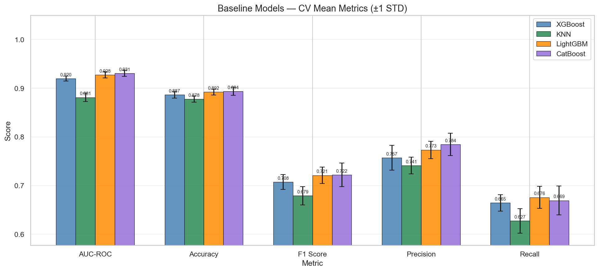
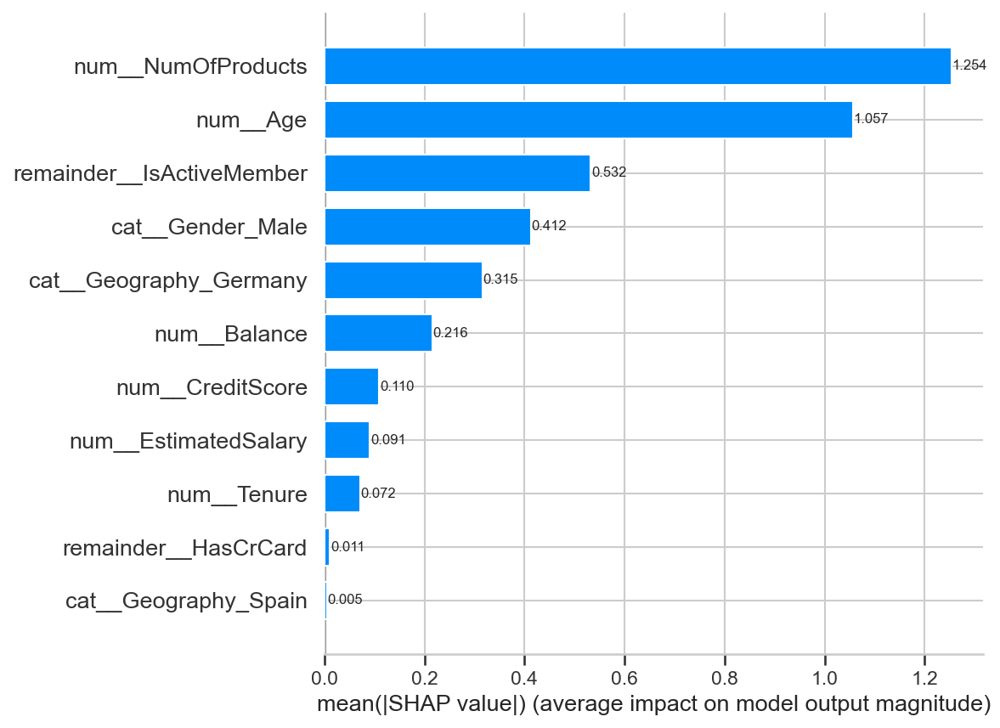
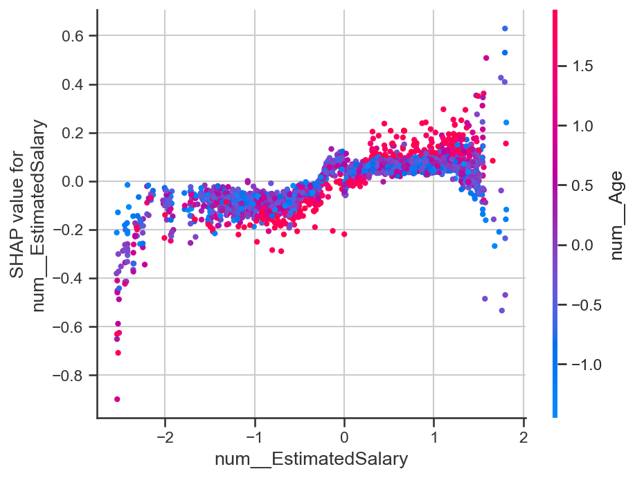

# 📉 ML Customer Churn Prediction

> **Predict who's leaving — before they do.**  
> A machine learning pipeline that identifies at-risk customers using gradient boosting models (CatBoost) and explains *why* they're predicted to churn using SHAP (SHapley Additive exPlanations).

---

## 🧭 Table of Contents

- [Business Overview](#-business-overview)
- [Technical Overview](#-technical-overview)
- [Project Structure](#-project-structure)
- [Pipeline Walkthrough](#-pipeline-walkthrough)
- [Models Used](#-models-used)
- [Model Interpretability — SHAP](#-model-interpretability--shap)
- [Key Business Insights](#-key-business-insights)
- [How to Run](#-how-to-run)
- [Dependencies](#-dependencies)
- [License](#-license)

---

## 💼 Business Overview

**Customer churn** — when a customer stops doing business with you — is one of the most costly problems in subscription-based industries (telecom, SaaS, banking, streaming). Acquiring a new customer typically costs **5–7× more** than retaining an existing one.

This project solves a critical business question:

> *"Which of our current customers are most likely to leave in the near future, and what is driving that behavior?"*

### What This Model Delivers

| Business Need | What the Model Provides |
|---|---|
| Proactive retention | Ranked list of at-risk customers before they churn |
| Root-cause understanding | Per-customer explanation of churn drivers (SHAP) |
| Resource prioritisation | Focus retention spend on high-risk, high-value segments |
| Strategy input | Identifies product/service factors linked to churn at scale |

### Who Should Use This

- **Customer Success / Retention teams** — act on SHAP-explained risk scores per customer
- **Marketing** — personalise outreach to high-risk cohorts
- **Product** — identify service pain points correlated with churn
- **Executives / Analysts** — understand portfolio-level churn risk

---

## 🔬 Technical Overview

This is an end-to-end supervised binary classification pipeline built in Python. The target variable is whether a customer **churned (1)** or **stayed (0)**.

**Core technical components:**

- **Data Processing** — cleaning, encoding, feature engineering
- **Model Training** — multiple classifiers including CatBoost
- **Hyperparameter Tuning** — fine-tuning for optimal generalisation
- **Evaluation** — metrics suited to imbalanced classification (AUC-ROC, F1, Precision/Recall)
- **Interpretability** — global and local SHAP analysis for model explainability

**Tech stack:** `Python` · `CatBoost` · `scikit-learn` · `SHAP` · `pandas` · `numpy`

---

## 📁 Project Structure

```
ML_Customer-Churn-Prediction/
│              
│
├── data_processing/              # Data ingestion, cleaning & feature engineering
│   ├── EDA.py                 # Learn data characteristics
│   ├── normalization_encoding.py            # Normalization to prevent bias and skewed figures and encoding for catergorical data
│   └── train_test_split.py            # Define training and testing datasets    
│
├── model/                        # Model training, tuning, and evaluation
│   ├── models.py                 # Model definitions and training logic
│   ├── fine_tuning.py            # Hyperparameter optimisation
│   └── evaluation.py            # Metrics: AUC, F1, Precision, Recall, etc.
│
├── SHAP_interpretation/          # Explainability layer — global & local SHAP analysis
│   └── SHAP.py
│
├── catboost_info/                # CatBoost training logs and metadata
│
├── output_storage/              # Saved models, predictions, and SHAP outputs
│
├── run.py                     #To run model wholly
├── README.md
└── LICENSE
```

---

## 🔄 Pipeline Walkthrough

```
Raw Customer Data
       │
       ▼
┌─────────────────────┐
│   data_processing   │  ← Clean nulls, encode categoricals,
│                     │    engineer features (tenure buckets,
└─────────────────────┘    contract type flags, charge ratios)
       │
       ▼
┌─────────────────────┐
│   model/models.py   │  ← Train candidate models
│                     │    (CatBoost, others)
└─────────────────────┘
       │
       ▼
┌─────────────────────────┐
│  model/fine_tuning.py   │  ← Hyperparameter search
│                         │    (grid/random/Bayesian search)
└─────────────────────────┘
       │
       ▼
┌─────────────────────────┐
│  model/evaluation.py    │  ← AUC-ROC, F1, Precision,
│                         │    Recall, Confusion Matrix
└─────────────────────────┘
       │
       ▼
┌─────────────────────────────┐
│  SHAP_interpretation/SHAP   │  ← Global feature importance
│                             │    + per-customer explanations
└─────────────────────────────┘
       │
       ▼
  output_storage/
  (predictions + SHAP plots + model artefacts)
```

---

## 🧠 Model Selection Summary

A combination of traditional and advanced ensemble learning algorithms was selected to provide a comprehensive comparison of classification performance for customer churn prediction.

- **Tree-based boosting models** such as **XGBoost**, **LightGBM**, and **CatBoost** were chosen because they are highly effective for structured/tabular datasets and can capture complex nonlinear relationships between customer attributes and churn behaviour.

- **KNN** was included as a baseline distance-based classifier to compare simpler instance-based learning against ensemble boosting approaches.

- The selected models provide diversity in:
  - Learning mechanisms
  - Computational complexity
  - Feature handling capabilities
  - Interpretability and scalability

This comparison helps identify the most suitable model for balancing predictive accuracy and business interpretability in churn analysis.

---

## 📊 Evaluation Metrics

| Metric | Description |
|---|---|
| **AUC-ROC** | Measures the model’s ability to distinguish between churners and non-churners across all thresholds |
| **Precision** | Percentage of predicted churners that were actually churners |
| **Recall** | Percentage of actual churners correctly identified |
| **F1 Score** | Harmonic mean of Precision and Recall |
| **Accuracy** | Measures the overall percentage of correctly classified instances |


> **Business Insight:**  
> In customer churn prediction, **Recall** is often prioritised because missing a potential churner can lead to customer loss, while falsely flagging a loyal customer is usually less costly.

---

## 🔍 SHAP Explainability Analysis

To improve model interpretability, SHAP (SHapley Additive exPlanations) was applied to explain how each feature contributed to the churn prediction outcomes of the final tree-based classification model.

The analysis was performed using `TreeExplainer`, which is specifically designed for ensemble tree models and provides both global and local feature importance interpretations.

```python
explainer   = shap.TreeExplainer(model)
shap_values = explainer.shap_values(X_test_transform)
```

The generated SHAP outputs include:

- Individual SHAP values for each prediction
- Mean absolute SHAP feature importance
- SHAP summary plot
- SHAP bar plot
- SHAP dependence plot

---

## 📊 Global Feature Importance (Mean Absolute SHAP)

The mean absolute SHAP values indicate the overall contribution strength of each feature toward churn prediction.

| Feature | Mean Absolute SHAP Value | Interpretation |
|---|---|---|
| **NumOfProducts** | 1.254 | Strongest predictor of customer churn |
| **Age** | 1.057 | Older customers showed higher churn influence |
| **IsActiveMember** | 0.532 | Active membership strongly reduced churn probability |
| **Gender (Male)** | 0.412 | Gender had moderate predictive influence |
| **Geography (Germany)** | 0.315 | German customers showed higher churn tendency |
| **Balance** | 0.216 | Higher account balances contributed to churn prediction |
| **CreditScore** | 0.110 | Lower influence but still contributed to prediction |
| **EstimatedSalary** | 0.091 | Weak nonlinear contribution to churn |
| **Tenure** | 0.072 | Longer tenure slightly reduced churn likelihood |
| **HasCrCard** | 0.011 | Minimal impact on prediction |
| **Geography (Spain)** | 0.005 | Negligible influence on churn |

---

## 📈 SHAP Summary Plot Interpretation

The SHAP summary plot visualises both:
- Feature importance ranking
- Directional impact of feature values on churn prediction

### Key Findings

- **NumOfProducts** was the most influential feature.  
  Customers with certain product ownership patterns had significantly higher positive SHAP values, meaning they were more likely to churn.

- **Age** showed a strong positive relationship with churn.  
  Higher age values generally increased the model output toward churn prediction.

- **IsActiveMember** displayed negative SHAP values for active customers, indicating that active members were less likely to churn.

- **Germany geography encoding** contributed positively toward churn prediction, suggesting customers from Germany had a relatively higher churn tendency compared to other regions.

- **Balance** showed moderate influence where higher balances slightly increased churn likelihood.

- Features such as **HasCrCard** and **Geography_Spain** had SHAP values concentrated near zero, indicating minimal predictive contribution.

---

## 📊 SHAP Bar Plot Interpretation

The SHAP bar plot presents the average absolute contribution of each feature across all predictions.



The results confirm that:
- Customer product usage behavior (**NumOfProducts**) was the dominant churn driver.
- Demographic information such as **Age** and **Geography** played important roles.
- Behavioral engagement features like **IsActiveMember** strongly affected retention outcomes.
- Financial-related variables contributed less compared to behavioral indicators.

This indicates that customer engagement and service usage patterns were more informative than purely financial attributes.

---

## 📉 SHAP Dependence Plot — Estimated Salary

The dependence plot illustrates how changes in `EstimatedSalary` influenced SHAP values and model predictions.



### Key Observations

- The relationship between `EstimatedSalary` and churn prediction was nonlinear.
- Moderate-to-high salary values tended to slightly increase SHAP values, contributing positively toward churn prediction.
- Extremely low salary values often produced negative SHAP values, reducing predicted churn probability.
- The spread of points indicates interaction effects between `EstimatedSalary` and other variables such as `Age`.

Although `EstimatedSalary` was not among the strongest predictors, the dependence plot reveals subtle interaction patterns captured by the model.

---

## 🧠 Overall SHAP Interpretation

The SHAP analysis demonstrated that the final model primarily relied on:
- Customer engagement behavior
- Product ownership patterns
- Demographic characteristics

rather than purely financial variables.

This provides strong business interpretability and helps organisations identify:
- High-risk customer groups
- Important retention drivers
- Features most associated with churn behaviour

The explainability analysis also increases trust in the predictive model by making feature contributions transparent and interpretable.

---

## 🚀 How to Run

### 1. Clone the repository

```bash
git clone https://github.com/Grace-VN/ML_Customer-Churn-Prediction.git
cd ML_Customer-Churn-Prediction
```

### 2. Install dependencies

```bash
pip install -r requirements.txt
```

Or manually:

```bash
pip install catboost scikit-learn shap pandas numpy matplotlib
```

### 3. Run the full pipeline

```bash
python run.py
```

The entry point (`run.py`) orchestrates the full flow:

```python
# run.py
from model import models, fine_tuning, evaluation
from SHAP_interpretation import SHAP
```

Outputs (predictions, model files, SHAP plots) are saved to `output_storage/`.

---

## 📦 Dependencies

| Package | Purpose |
|---|---|
| `catboost` | Primary gradient boosting model |
| `scikit-learn` | Preprocessing, model selection, evaluation metrics |
| `shap` | Model interpretability and feature attribution |
| `pandas` | Data manipulation and feature engineering |
| `numpy` | Numerical operations |
| `matplotlib` / `seaborn` | Visualisation of SHAP plots and evaluation curves |

---

## 📄 License

This project is licensed under the **MIT License** — see [LICENSE](LICENSE) for details.

---

## 👩‍💻 Author

**Grace-VN** · [GitHub Profile](https://github.com/Grace-VN)

---

*Built to turn raw customer data into actionable retention intelligence.*
